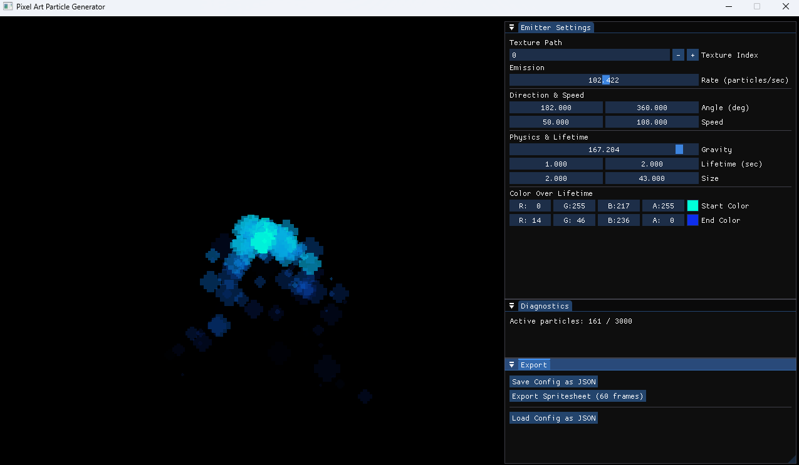

<p align="center">

</p>

<h1 align="center">Straightforward particle visualisation</h1>

<p align="center">Welcome to PixPart! A simple pixel art particle generator made in C#.</p>

## How does it work?
This is a simple particle generator, build to accomodate game developers in the sense of simple json exports, nothing more!
It's built with C# and [raylib](https://www.raylib.com/) using the [Raylib-cs bindings](https://github.com/raylib-cs/raylib-cs).

[ImGuiNET](https://github.com/ImGuiNET/ImGui.NET) was used for the UI together with [rlImGui-cs](https://github.com/raylib-extras/rlImGui-cs) to facilitate render capabilities through raylib.

<br>

<p align="center">
  
</p>

## How to use it?
After you have installed the source code, run a ```dotnet restore``` in the command line. Open it in Visual Studio Code, or any other IDE that is able to handle C# projects, and run the ```dotnet run``` command in the terminal.

Tweak the parameters on the right to change how the simulation works. Experimenting is the key to understanding How the values change the particles.

After you are done, hit the <b>Save</b> button down bellow and give the .json file a name that fits. If you reboot the program you can <b>Load</b> the .json file you just saved with the button down there.

Since the project is just a simple particle generator visualizer it doesn't provide ways to import the particles into a Game Engine or Framework.
You'll have to write your own importer (don't worry, it's just simple json data ;)).

## Showcase
https://github.com/user-attachments/assets/0947536d-67c8-49ca-aafe-7c7a234c9fa1
